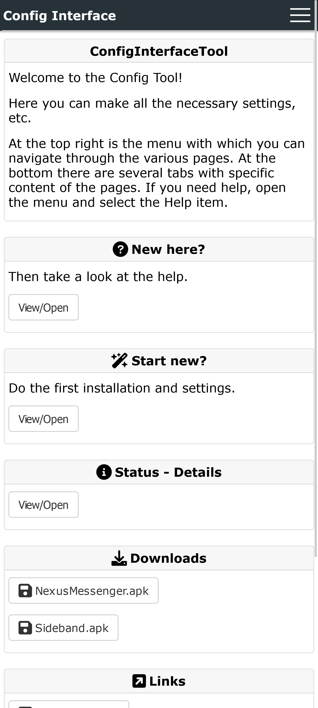
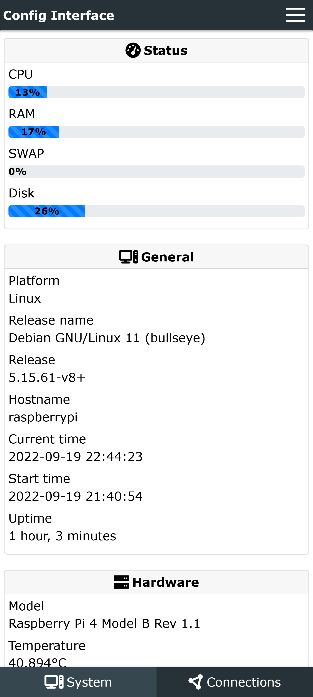
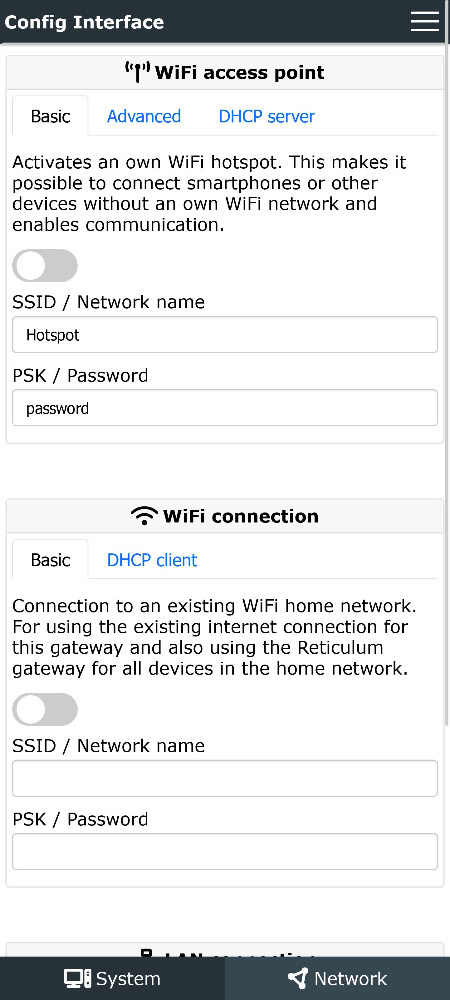
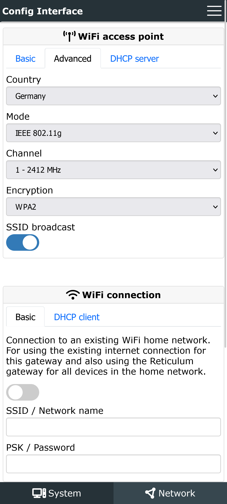
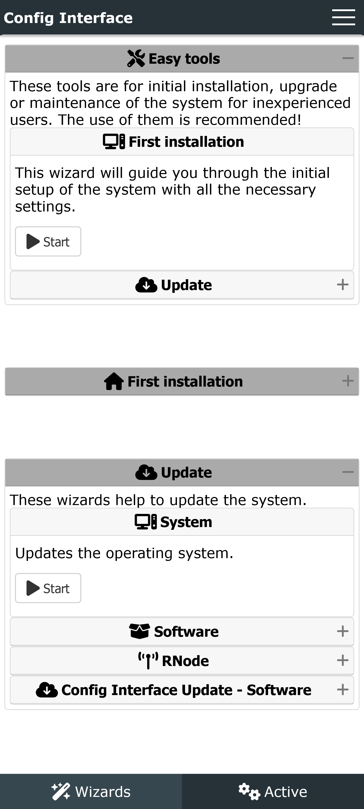
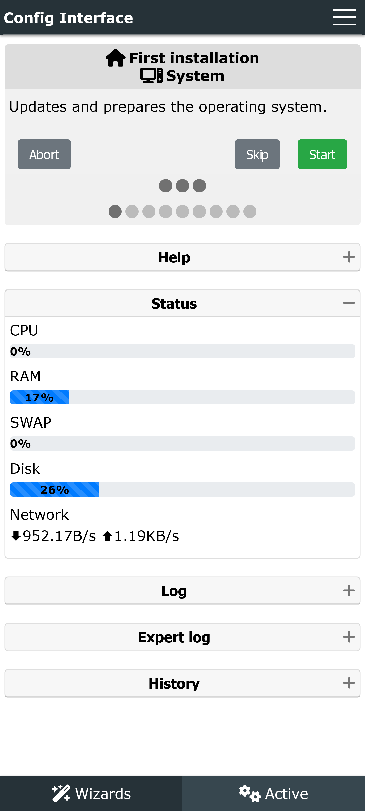
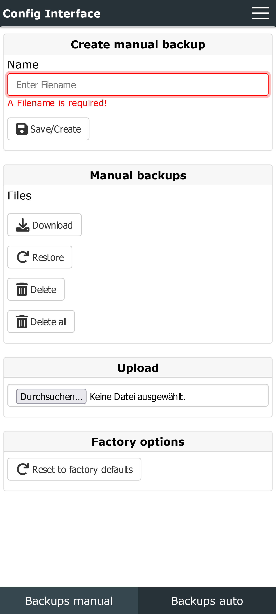

# ConfigInterfaceTool
Easy, minimalistic and simple interface for device/application administration and configuration.


The software is still at a very early stage of development.
It serves a Proof of Concept (PoC) which shows the basic feasibility and functionality.

The basic functions are error-free and functionally implemented. In the config files are a few basic functions documented and shown with examples.
The Documentation is not yet available.
Due to lack of time I can also not say when this will be further processed.


### Features

- Customizable web interface.
- Only edit the internal config files. No need of programming code like python, php, html, javascript, css, or similar.
- Relatively easy to customize (even without programming knowledge) within the given widgets/elements.
- Easy to integrate additional configurations.
- View system/software/hardware status.
- Edit config files.
- Execute commands.
- Running external scripts/programs as a wizard and display in the web interface.
- Translate wizard output to different languages.
- Backup/Restore of the configuration.
- Install/Deinstall software. (Not yet implemented)
- Manage services (Start/Stop/Enable/Disable). (Not yet implemented)
- Update system/programs/itself. (Not yet implemented)
- Shutdown/Reboot the system.
- Multi language support.
- Preconfigured layout styles.
- Preconfigured widgets and display options.
- Plain text/web sites.
- Installer/Updater for easy installation of the tool itsef. All necessary dependencies are installed automatically.
- 3 different python web server options: Gunicorn (Recommended), Flask, aiohttp
- Reverse proxy Nginx compatible (included in the Installer).
- Addon (Optional): Web-Terminal


### Supported config file types/formates
- text: Replace predefined placeholders/variables in the text: Source -> Destination (Replace)
- env: Standard environment variables `key=value`
- ini: Standard ini like files
- json (Not yet implemented): Standard json format
- keyagr: `key value`
- keyval: `key=value`
- toml (Not yet implemented): Standard toml format
- xml (Not yet implemented): Standard xml format
- yaml (Not yet implemented): Standard yaml format
- raw: Plain text files


### Config processing options
- Source -> Destination (Replace): Only for type `text`. The configuration is copied to the destination and defined placeholders will be replaced with the configured values.
- Source -> Destination (Edit): The configuration is copied to the destination and processed.
- Destination -> Destination (Edit): The configuration is edited/replaced directly in the destination. If the file does not exist, it will be copied to the destination.


## Current Status
It should currently be considered beta software and still work in progress.

All core features are implemented and functioning, but additions will probably occur as real-world use is explored.

There may be errors or the compatibility after an update is no longer guaranteed.

The full documentation is not yet available. Due to lack of time I can also not say when this will be further processed.


## Development Roadmap
- Planned, but not yet scheduled
  - Improve config file section handling.
  - Add new config formats: json, toml, xml, yaml
  - Different small fixes and improvements
  - Backup/restore the whole tool.
  - Wizard status display
  - Initial Restore/Backup
  - Design/Display improvements
  - Install/Deinstall software
  - Manage services (Start/Stop/Enable/Disable)
  - Session management
  - Remote connection
  - Documentation


## Dependencies
With the installer all dependencies are installed automatically.

Manual installation (Internal web server without reverse proxy):
```bash
apt install python3-pip

pip3 install psutil

pip3 install gunicorn flask flask_httpauth

pip3 install flask_socketio
```


## Quick commands

Installation - Easy:
```bash
wget https://raw.githubusercontent.com/SebastianObi/ConfigInterfaceTool/main/releases/install_online.sh -O install_online.sh; bash install_online.sh
```

Installation - Download with user interaction:
```bash
wget https://raw.githubusercontent.com/SebastianObi/ConfigInterfaceTool/main/releases/install.sh -O install.sh; bash install.sh -r
```

Installation - Download without user interaction:
```bash
wget https://raw.githubusercontent.com/SebastianObi/ConfigInterfaceTool/main/releases/install.sh -O install.sh; bash install.sh -r -u
```

Update - With user interaction:
```bash
wget https://raw.githubusercontent.com/SebastianObi/ConfigInterfaceTool/main/releases/update.sh -O update.sh; bash update.sh
```

Update - Without user interaction:
```bash
wget https://raw.githubusercontent.com/SebastianObi/ConfigInterfaceTool/main/releases/update.sh -O update.sh; bash update.sh -r -u
```


## Installation - Auto/Installer:
The following commands will perform an automatic installation.
```bash
wget https://raw.githubusercontent.com/SebastianObi/ConfigInterfaceTool/main/releases/install.sh -O install.sh; bash install.sh -r
```


## Installation - Manual:
Use the following commands to install and setup everything manually. The software must be started manually. If an autostart is desired, a startscript must be created.
```bash
apt install python3-pip

pip3 install psutil

pip3 install gunicorn flask flask_httpauth

pip3 install flask_socketio

git clone https://github.com/SebastianObi/ConfigInterfaceTool

cd ConfigInterfaceTool

chmod +x bin/main*.py
chmod +x *.sh
chmod +x service_templates/*.sh
chmod +x software_templates/*.sh
chmod +x wizard_templates/*.sh

./bin/main.py
```


## Usable commands - Manual Setup/Execution

Install:
```bash
./install.sh
```

Uninstall:
```bash
./uninstall.sh
```

Update:
```bash
./update.sh
```

Start:
```bash
./bin/main.py
```

Start (Test mode & Log-Lebel 9 = Debug):

In test mode no configuration files are changed or commands are executed. All files are stored in the folder "test/" instead. The wizards continue to work in normal mode.
```bash
./bin/main.py -t -l 9
```


## Usable commands - Automatic installation

Start service:
```bash
systemctl start configinterfacetool
systemctl start configinterfacetool-addon
```

Stop service:
```bash
systemctl stop configinterfacetool
systemctl stop configinterfacetool-addon
```

Enable service:
```bash
systemctl enable configinterfacetool
systemctl enable configinterfacetool-addon
```

Disable service:
```bash
systemctl disable configinterfacetool
systemctl disable configinterfacetool-addon
```


## Start parameters "./bin/main.py"
```bash
usage: main.py [-h] [-p PATH] [-pl PATH_LOG] [-l LOGLEVEL] [-s] [-t] [--clear] [--clearbackup] [--cleartest] [--defaultconfig] [--exampleconfig]
               [--userget] [--userdelete USERDELETE] [--user USER] [--password PASSWORD] [--variablesget]

ConfigInterfaceTool - Easy, minimalistic and simple interface for device/application administration and configuration.

optional arguments:
  -h, --help            show this help message and exit
  -p PATH, --path PATH  Path to alternative config directory
  -pl PATH_LOG, --path_log PATH_LOG
                        Path to alternative log directory
  -l LOGLEVEL, --loglevel LOGLEVEL
  -s, --service         Running as a service and should log to file
  -t, --test            Test Mode (No changes to files and no execution of cmd/script.)
  --clear               Delete all temporary files
  --clearbackup         Delete backup files
  --cleartest           Delete temporary test mode files
  --defaultconfig       Reset the configuration to default
  --exampleconfig       Print verbose configuration example to stdout and exit
  --userget             User administration - List all users
  --userdelete USERDELETE
                        User administration - Delete USER
  --user USER           User administration - Edit/Add USER
  --password PASSWORD   User administration - Set PASSWORD
  --variablesget        Variables - List all system/user variables
```


## Start parameters "./bin/main_terminal.py"
```bash
usage: main_terminal.py [-h] [--host HOST] [--port PORT] [--path_root PATH_ROOT] [--path_redirect_root PATH_REDIRECT_ROOT]
                        [--path_redirect_not_found PATH_REDIRECT_NOT_FOUND] [--auth] [--auth_file AUTH_FILE] [--path_terminal PATH_TERMINAL] [--cmd CMD]
                        [--cmd_args CMD_ARGS] [-p PATH] [-pl PATH_LOG] [-l LOGLEVEL] [-s] [--userget] [--userdelete USERDELETE] [--user USER]
                        [--password PASSWORD]

Terminal - Simple and easy web terminal

optional arguments:
  -h, --help            show this help message and exit
  --host HOST           Host to run server (Use 0.0.0.0 to allow access from anywhere)
  --port PORT           Port to run server
  --path_root PATH_ROOT
                        Server root path
  --path_redirect_root PATH_REDIRECT_ROOT
                        Root/Index file
  --path_redirect_not_found PATH_REDIRECT_NOT_FOUND
                        Redirect file
  --auth                Enable authentication
  --auth_file AUTH_FILE
                        Authentication/User config file
  --path_terminal PATH_TERMINAL
                        Terminal start path
  --cmd CMD             Command to run in the terminal
  --cmd_args CMD_ARGS   Arguments to pass to command (i.e. --args='arg1 arg2 --flag')
  -p PATH, --path PATH  Path to alternative config directory
  -pl PATH_LOG, --path_log PATH_LOG
                        Path to alternative log directory
  -l LOGLEVEL, --loglevel LOGLEVEL
  -s, --service         Running as a service and should log to file
  --userget             User administration - List all users
  --userdelete USERDELETE
                        User administration - Delete USER
  --user USER           User administration - Edit/Add USER
  --password PASSWORD   User administration - Set PASSWORD
```


## Screenshots



## Instructions for the administration

In each folder that is relevant for the administration there are example files that start with the name "example_". These files contain extended descriptions of the parameters. These files should explain the functionality of this tool.


### Folders
- config_files

This folder is used to configure the web interface and files. The processing takes place in alphabetical order. If a page is to be displayed higher up, the file name must be adjusted accordingly. All files must have the extension .cfg. Otherwise they will be ignored. All files are in INI format. There are different types of files which must be defined under main\type. These are:
config=normal configuration for applications, content=pure content of the webinterface for display without further functions, service=definition of the service main page, software=definition of the service main page, wizard=definition of the main service page.

- config_templates

The configuration files of the applications to be used are stored in this folder. The files are defined in the config file in the config_files folder.

- service_files

This folder is used to configure the services. The processing takes place in alphabetical order.

- service_templates

Scripts which are executed during the service actions are stored here. For an automatic assignment to the configurations, the file name (without extension) must be identical to the file name in the folder service_files.

- software_files

This folder is used to configure the software. The processing takes place in alphabetical order.

- software_templates

Scripts which are executed during software actions are stored here. For an automatic assignment to the configurations, the file name (without extension) must be identical to the file name in the folder software_files.

- wizard_files

This folder is used to configure the wizards. The processing takes place in alphabetical order.

- wizard_templates

Scripts which are executed during the wizard actions are stored here. For an automatic assignment to the configurations, the file name (without extension) must be identical to the file name in the folder wizard_files.


### System/User variables
- To display all variables currently available, the following command can be used.
  ```
  ./bin/main.py --variablesget
  ```

- Example values - require_system:
  ```
  model:raspberry pi 4 model b rev 1.1 - platform:linux - release:5.15.32-v8+
  model:raspberry pi 3 model b rev 1.2 - platform:linux - release:5.15.32-v8+
  model:orangepi zero2\x00 - platform:linux - release:5.16.17-sun50iw9
  ```


### How to make the software available on a web server as a download for clients
1. Change the download paths according to your own specifications in the following files.
   - install.sh
   - install_online.sh
   - update.sh
   - wizard_tenplates/self_update_config.sh
   - wizard_templates/self_update_software.sh
   ```
   DOWNLOAD_URL_SERVER="https://raw.githubusercontent.com/SebastianObi/ConfigInterfaceTool/main/releases/"
   ```

2. Build/generate new files with the command `./build.sh`

3. Copy the generated files from the folder `releases` to your own folder on the web server.

4. Share the links to the `.sh` files.


## Support / Donations
You can help support the continued development by donating via one of the following channels:

- PayPal: https://paypal.me/SebastianObi
- Liberapay: https://liberapay.com/SebastianObi/donate


## Support in another way?
You are welcome to participate in the development. Just create a pull request. Or just contact me for further clarifications.


## Do you need a special function or customization?
Then feel free to contact me. Customizations or tools developed specifically for you can be realized.


## FAQ

### Why this new tool and not an existing one?
All existing admin/config tools did not meet the required prerequisites.
The goal was to create a simple and minimalistic interface which contains only the most necessary things.
It is also relatively easy to extend for the configuration of other applications on the server.
All existing tools are quite complex to change.

### Why python?
Since python is a relatively simple programming language.
The applications that are to be administered in a usecase have also been programmed with python.
That is why python was chosen.