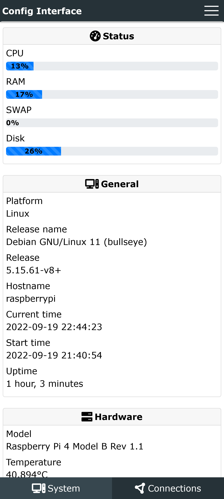
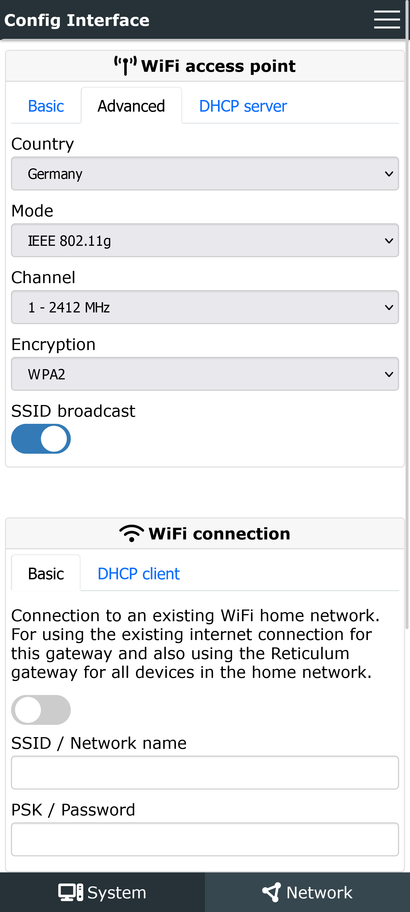
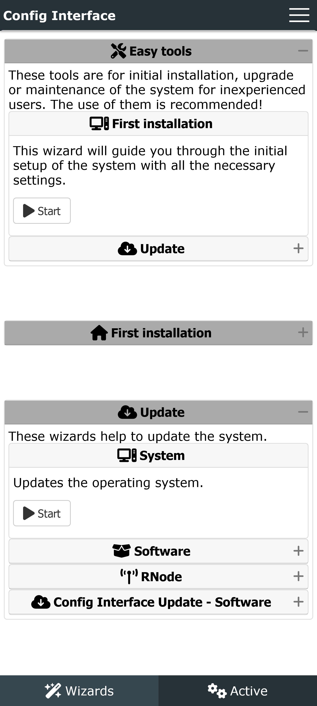
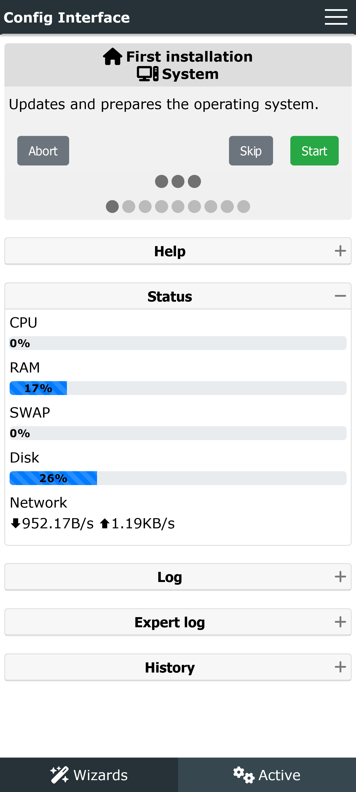
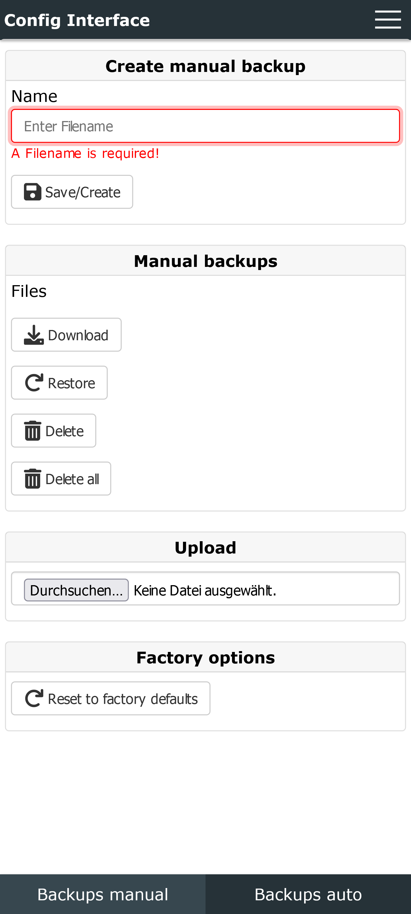

# ConfigInterfaceTool
Leichte, minimalistische und einfache Schnittstelle für die Verwaltung und Konfiguration von Geräten und Anwendungen.


Die Software befindet sich noch in einem sehr frühen Stadium der Entwicklung.
Sie dient als Proof of Concept (PoC), der die grundsätzliche Machbarkeit und Funktionalität zeigt.

Die Grundfunktionen sind fehlerfrei und funktionsfähig implementiert. In den Konfigurationsdateien sind einige Grundfunktionen dokumentiert und mit Beispielen dargestellt.
Die Dokumentation ist noch nicht verfügbar.
Aus Zeitmangel kann ich auch nicht sagen, wann diese weiter bearbeitet wird.


### Merkmale

- Anpassbare Weboberfläche.
- Bearbeiten Sie nur die internen Konfigurationsdateien. Keine Notwendigkeit von Programmiercode wie Python, php, html, javascript, css, oder ähnlichem.
- Relativ einfach anpassbar (auch ohne Programmierkenntnisse) innerhalb der vorgegebenen Widgets/Elemente.
- Einfache Integration zusätzlicher Konfigurationen.
- Anzeige des System-/Software-/Hardware-Status.
- Konfigurationsdateien bearbeiten.
- Ausführen von Befehlen.
- Externe Skripte/Programme als Assistenten ausführen und in der Weboberfläche anzeigen.
- Übersetzen der Assistentenausgabe in verschiedene Sprachen.
- Sichern/Wiederherstellen der Konfiguration.
- Installation/Deinstallation von Software. (Noch nicht implementiert)
- Verwalten von Diensten (Starten/Stoppen/Aktivieren/Deaktivieren). (Noch nicht implementiert)
- System/Programme/sich selbst aktualisieren. (noch nicht implementiert)
- Herunterfahren/Neustarten des Systems.
- Unterstützung für mehrere Sprachen.
- Vorkonfigurierte Layout-Stile.
- Vorkonfigurierte Widgets und Anzeigeoptionen.
- Klartext/Webseiten.
- Installer/Updater für die einfache Installation des Tools selbst. Alle notwendigen Abhängigkeiten werden automatisch installiert.
- 3 verschiedene Python-Webserver-Optionen: Gunicorn (empfohlen), Flask, aiohttp
- Reverse Proxy Nginx kompatibel (im Installer enthalten).
- Addon (Optional): Web-Terminal


### Unterstützte Konfigurationsdateitypen/-formate
- Text: Ersetzen von vordefinierten Platzhaltern/Variablen im Text: Quelle -> Ziel (Ersetzen)
- env: Standard-Umgebungsvariablen `key=value`
- ini: Standard ini ähnliche Dateien
- json (noch nicht implementiert): Standard json-Format
- keyagr: `Schlüsselwert`
- keyval: `Schlüssel=Wert`
- toml (Noch nicht implementiert): Standard toml Format
- xml (Noch nicht implementiert): Standard-Xml-Format
- yaml (Noch nicht implementiert): Standard yaml-Format
- roh: Klartextdateien


### Optionen für die Verarbeitung in der Konfiguration
- Quelle -> Ziel (Ersetzen): Nur für den Typ `Text`. Die Konfiguration wird in das Ziel kopiert und die definierten Platzhalter werden durch die konfigurierten Werte ersetzt.
- Quelle -> Ziel (Bearbeiten): Die Konfiguration wird in das Ziel kopiert und bearbeitet.
- Ziel -> Ziel (Bearbeiten): Die Konfiguration wird direkt im Ziel bearbeitet/ersetzt. Existiert die Datei nicht, wird sie in das Ziel kopiert.


## Aktueller Status
Die Software befindet sich derzeit noch in der Betaphase und ist noch nicht abgeschlossen.

Alle Kernfunktionen sind implementiert und funktionieren, aber Ergänzungen werden wahrscheinlich auftreten, wenn die reale Nutzung erforscht wird.

Es kann zu Fehlern kommen oder die Kompatibilität nach einem Update ist nicht mehr gewährleistet.

Die vollständige Dokumentation ist noch nicht verfügbar. Aus Zeitmangel kann ich auch nicht sagen, wann diese weiterbearbeitet werden wird.


## Entwicklungsfahrplan
- Geplant, aber noch nicht terminiert
  - Verbessern der Handhabung von Konfigurationsdateisektionen.
  - Hinzufügen neuer Konfigurationsformate: json, toml, xml, yaml
  - Verschiedene kleine Korrekturen und Verbesserungen
  - Sichern/Wiederherstellen des gesamten Tools.
  - Statusanzeige des Assistenten
  - Erste Wiederherstellung/Backup
  - Design/Display Verbesserungen
  - Software installieren/deinstallieren
  - Verwaltung von Diensten (Starten/Stoppen/Aktivieren/Deaktivieren)
  - Sitzungsverwaltung
  - Remote-Verbindung
  - Dokumentation


## Abhängigkeiten
Mit dem Installationsprogramm werden alle Abhängigkeiten automatisch installiert.

Manuelle Installation (Interner Webserver ohne Reverse Proxy):
```bash
apt install python3-pip

pip3 install psutil

pip3 install gunicorn flask flask_httpauth

pip3 install flask_socketio
```


## Schnelle Befehle

Installation - Easy:
```bash
wget https://raw.githubusercontent.com/SebastianObi/ConfigInterfaceTool/main/releases/install_online.sh -O install_online.sh; bash install_online.sh
```

Installation - Download mit Benutzerinteraktion:
```bash
wget https://raw.githubusercontent.com/SebastianObi/ConfigInterfaceTool/main/releases/install.sh -O install.sh; bash install.sh -r
```

Installation - Download ohne Benutzerinteraktion:
```bash
wget https://raw.githubusercontent.com/SebastianObi/ConfigInterfaceTool/main/releases/install.sh -O install.sh; bash install.sh -r -u
```

Update - Mit Benutzerinteraktion:
```bash
wget https://raw.githubusercontent.com/SebastianObi/ConfigInterfaceTool/main/releases/update.sh -O update.sh; bash update.sh
```

Aktualisierung - ohne Benutzerinteraktion:
```bash
wget https://raw.githubusercontent.com/SebastianObi/ConfigInterfaceTool/main/releases/update.sh -O update.sh; bash update.sh -r -u
```


## Installation - Auto/Installer:
Mit den folgenden Befehlen wird eine automatische Installation durchgeführt.
```bash
wget https://raw.githubusercontent.com/SebastianObi/ConfigInterfaceTool/main/releases/install.sh -O install.sh; bash install.sh -r
```


## Installations Handbuch:
Verwenden Sie die folgenden Befehle, um alles manuell zu installieren und einzurichten. Die Software muss manuell gestartet werden. Wenn ein Autostart gewünscht ist, muss ein Startscript erstellt werden.
```bash
apt install python3-pip

pip3 install psutil

pip3 install gunicorn flask flask_httpauth

pip3 install flask_socketio

git clone https://github.com/SebastianObi/ConfigInterfaceTool

cd ConfigInterfaceTool

chmod +x bin/main*.py
chmod +x *.sh
chmod +x service_templates/*.sh
chmod +x software_templates/*.sh
chmod +x wizard_templates/*.sh

./bin/main.py
```


## Verwendbare Befehle - Manuelle Einrichtung/Ausführung

Install:
```bash
./install.sh
```

Uninstall:
```bash
./uninstall.sh
```

Update:
```bash
./update.sh
```

Start:
```bash
./bin/main.py
```

Start (Test mode & Log-Lebel 9 = Debug):

Im Testmodus werden keine Konfigurationsdateien geändert oder Befehle ausgeführt. Alle Dateien werden stattdessen im Ordner "test/" gespeichert. Die Assistenten funktionieren weiterhin im normalen Modus.
```bash
./bin/main.py -t -l 9
```


## Verwendbare Befehle - Automatische Installation

Start service:
```bash
systemctl start configinterfacetool
systemctl start configinterfacetool-addon
```

Stop service:
```bash
systemctl stop configinterfacetool
systemctl stop configinterfacetool-addon
```

Enable service:
```bash
systemctl enable configinterfacetool
systemctl enable configinterfacetool-addon
```

Disable service:
```bash
systemctl disable configinterfacetool
systemctl disable configinterfacetool-addon
```


## Start Parameter "./bin/main.py"
```bash
usage: main.py [-h] [-p PATH] [-pl PATH_LOG] [-l LOGLEVEL] [-s] [-t] [--clear] [--clearbackup] [--cleartest] [--defaultconfig] [--exampleconfig]
               [--userget] [--userdelete USERDELETE] [--user USER] [--password PASSWORD] [--variablesget]

ConfigInterfaceTool - Leichte, minimalistische und einfache Schnittstelle für die Verwaltung und Konfiguration von Geräten und Anwendungen.

optionale Argumente:
  -h, --help            diese Hilfemeldung anzeigen und beenden
  -p PATH, --path PATH  Pfad zum alternativen Konfigurationsverzeichnis
  -pl PATH_LOG, --path_log PATH_LOG
                        Pfad zum alternativen Protokollverzeichnis
  -l LOGLEVEL, --loglevel LOGLEVEL
  -s, --service         Läuft als Dienst und sollte sich in der Datei
  -t, --test            Test Mode (Keine Änderungen an Dateien und keine Ausführung von cmd/script.)
  --clear               Alle temporären Dateien löschen
  --clearbackup         Sicherungsdateien löschen
  --cleartest           Temporäre Testmodus-Dateien löschen
  --defaultconfig       Zurücksetzen der Konfiguration auf die Standardwerte
  --exampleconfig       Ausführliches Konfigurationsbeispiel nach stdout ausgeben und beenden
  --userget             Benutzerverwaltung - Liste aller Benutzer
  --userdelete USERDELETE
                        User administration - Lösche USER
  --user USER           User administration - Bearbeiten/Hinzufügen USER
  --password PASSWORD   User administration - PASSWORT definieren
  --variablesget        Variablen - Liste aller System-/Benutzervariablen
```


## Start Parameter "./bin/main_terminal.py"
```bash
usage: main_terminal.py [-h] [--host HOST] [--port PORT] [--path_root PATH_ROOT] [--path_redirect_root PATH_REDIRECT_ROOT]
                        [--path_redirect_not_found PATH_REDIRECT_NOT_FOUND] [--auth] [--auth_file AUTH_FILE] [--path_terminal PATH_TERMINAL] [--cmd CMD]
                        [--cmd_args CMD_ARGS] [-p PATH] [-pl PATH_LOG] [-l LOGLEVEL] [-s] [--userget] [--userdelete USERDELETE] [--user USER]
                        [--password PASSWORD]

Terminal - Einfaches und leichtes Web-Terminal

optionale Argumente:
  -h, --help            diese Hilfemeldung anzeigen und beenden
  --host HOST           Host, auf dem der Server läuft (verwenden Sie 0.0.0.0, um den Zugriff von überall zu ermöglichen)
  --port PORT           Port, auf dem der Server läuft
  --path_root PATH_ROOT
                        Stammverzeichnis des Servers
  --path_redirect_root PATH_REDIRECT_ROOT
                        Stamm-/Indexdatei
  --path_redirect_not_found PATH_REDIRECT_NOT_FOUND
                        Datei umlenken
  --auth                Authentifizierung einschalten
  --auth_file AUTH_FILE
                        Authentifizierung/Benutzerkonfigurationsdatei
  --path_terminal PATH_TERMINAL
                        Startpfad des Terminals
  --cmd CMD             Auszuführender Befehl im Terminal
  --cmd_args CMD_ARGS   Argumente, die dem Befehl übergeben werden (i.e. --args='arg1 arg2 --flag')
  -p PATH, --path PATH  Pfad zum alternativen Konfigurationsverzeichnis
  -pl PATH_LOG, --path_log PATH_LOG
                        Pfad zum alternativen Log-Verzeichnis
  -l LOGLEVEL, --loglevel LOGLEVEL
  -s, --service         Läuft als Dienst und sollte sich in der Datei
  --userget             Benutzerverwaltung - Liste aller Benutzer
  --userdelete USERDELETE
                        Benutzerverwaltung - USER löschen
  --user USER           Benutzerverwaltung - USER bearbeiten/hinzufügen
  --password PASSWORD   Benutzerverwaltung - PASSWORT festlegen
```


## Bilder



## Anweisungen für die Verwaltung

In jedem Ordner, der für die Verwaltung relevant ist, befinden sich Beispieldateien, die mit dem Namen "example_" beginnen. Diese Dateien enthalten erweiterte Beschreibungen der Parameter. Diese Dateien sollen die Funktionalität dieses Tools erklären.


### Ordner
- config_files

Dieser Ordner wird zur Konfiguration der Webschnittstelle und der Dateien verwendet. Die Bearbeitung erfolgt in alphabetischer Reihenfolge. Wenn eine Seite weiter oben angezeigt werden soll, muss der Dateiname entsprechend angepasst werden. Alle Dateien müssen die Endung .cfg haben. Andernfalls werden sie ignoriert. Alle Dateien liegen im INI-Format vor. Es gibt verschiedene Arten von Dateien, die unter main\type definiert werden müssen. Diese sind:
config=normale Konfiguration für Anwendungen, content=reiner Inhalt des Webinterfaces zur Anzeige ohne weitere Funktionen, service=Definition der Dienst-Hauptseite, software=Definition der Dienst-Hauptseite, wizard=Definition der Dienst-Hauptseite.

- config_templates

In diesem Ordner werden die Konfigurationsdateien der zu verwendenden Anwendungen gespeichert. Die Dateien werden in der Konfigurationsdatei im Ordner config_files definiert.

- service_files

Dieser Ordner wird zur Konfiguration der Dienste verwendet. Die Bearbeitung erfolgt in alphabetischer Reihenfolge.

- service_templates

Hier werden Skripte gespeichert, die bei den Serviceaktionen ausgeführt werden. Für eine automatische Zuordnung zu den Konfigurationen muss der Dateiname (ohne Erweiterung) mit dem Dateinamen im Ordner service_files identisch sein.

- software_files

Dieser Ordner wird zur Konfiguration der Software verwendet. Die Bearbeitung erfolgt in alphabetischer Reihenfolge.

- software_templates

Hier werden Skripte gespeichert, die bei Software-Aktionen ausgeführt werden. Für eine automatische Zuordnung zu den Konfigurationen muss der Dateiname (ohne Erweiterung) mit dem Dateinamen im Ordner software_files identisch sein.

- wizard_files

Dieser Ordner wird zur Konfiguration der Assistenten verwendet. Die Bearbeitung erfolgt in alphabetischer Reihenfolge.

- wizard_templates

Hier werden Skripte gespeichert, die während der Assistentenaktionen ausgeführt werden. Für eine automatische Zuordnung zu den Konfigurationen muss der Dateiname (ohne Erweiterung) mit dem Dateinamen im Ordner wizard_files identisch sein.


### System-/Benutzervariablen
- Um alle derzeit verfügbaren Variablen anzuzeigen, kann der folgende Befehl verwendet werden.
  ```
  ./bin/main.py --variablesget
  ```

- Beispielwerte - require_system:
  ```
  model:raspberry pi 4 model b rev 1.1 - platform:linux - release:5.15.32-v8+
  model:raspberry pi 3 model b rev 1.2 - platform:linux - release:5.15.32-v8+
  model:orangepi zero2\x00 - platform:linux - release:5.16.17-sun50iw9
  ```


### So stellen Sie die Software auf einem Webserver als Download für Kunden zur Verfügung
1. Ändern Sie die Download-Pfade in den folgenden Dateien nach Ihren eigenen Vorgaben.
   - install.sh
   - install_online.sh
   - update.sh
   - wizard_tenplates/self_update_config.sh
   - wizard_templates/self_update_software.sh
   ```
   DOWNLOAD_URL_SERVER="https://raw.githubusercontent.com/SebastianObi/ConfigInterfaceTool/main/releases/"
   ```

2. Erstellen/Generieren neuer Dateien mit dem Befehl `./build.sh`

3. Kopieren Sie die erzeugten Dateien aus dem Ordner `releases` in Ihren eigenen Ordner auf dem Webserver.

4. Geben Sie die Links zu den `.sh`-Dateien weiter.


## Unterstützung/Spenden
Sie können die weitere Entwicklung unterstützen, indem Sie über einen der folgenden Kanäle spenden:

- PayPal: https://paypal.me/SebastianObi
- Liberapay: https://liberapay.com/SebastianObi/donate


## Unterstützen Sie auf andere Weise?
Sie sind herzlich eingeladen, sich an der Entwicklung zu beteiligen. Erstellen Sie einfach einen Pull-Request. Oder kontaktieren Sie mich einfach für weitere Klärungen.


## Benötigen Sie eine spezielle Funktion oder Anpassung?
Dann nehmen Sie Kontakt mit mir auf. Speziell für Sie entwickelte Anpassungen oder Tools können realisiert werden.


## FAQ

### Warum dieses neue Tool und nicht ein bereits vorhandenes?
Alle vorhandenen Verwaltungs-/Konfigurationswerkzeuge erfüllten nicht die erforderlichen Voraussetzungen.
Das Ziel war es, eine einfache und minimalistische Schnittstelle zu schaffen, die nur das Nötigste enthält.
Es ist auch relativ einfach für die Konfiguration anderer Anwendungen auf dem Server zu erweitern.
Alle bestehenden Tools sind recht komplex zu ändern.

### Warum Python?
Weil Python eine relativ einfache Programmiersprache ist.
Die Anwendungen, die in einem Anwendungsfall verwaltet werden sollen, sind auch mit Python programmiert worden.
Deshalb wurde Python gewählt.